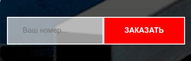

# Тестовое задание

- [ ] Сверстать форму с полем для ввода и кнопкой как на изображении

- [ ] Вид формы на мобильных устройствах

- [ ] Организовать простую валидацию поля (должно быть заполнено)

- [ ] При нажатии кнопки отправлять данные из формы на любой сервис (на ваше усмотрение) без перезагрузки страницы

- [ ] После получения ответа вывести уведомление о результате выполнения запроса

- [ ] Организовать сборку проекта при помощи Webpack с применением CSS препроцессора и оптимизацией скриптов под старые версии браузеров (SCSS, Babel)

- [ ] Включить в сборку проекта (Webpack) библиотеку шрифтов font-awesome, добавить любую иконку на кнопку

- [ ] Внести изменения в систему контроля версий (git)

## Для запуска проекта: 

Выполните команду:

### `npm install`

после чего 

### `npm start`

Откройте [http://localhost:4200](http://localhost:4200), чтобы просмотреть его в браузере.

## Для сборки проекта: 

Выполните команду:

### `npm run build`

